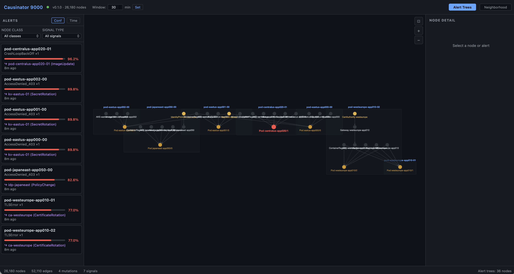
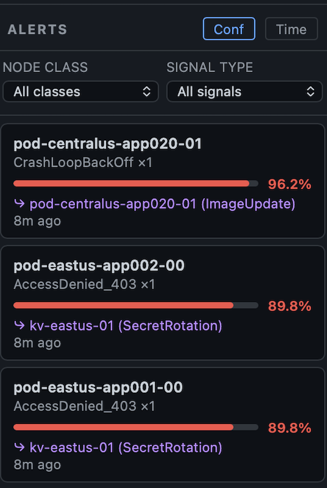
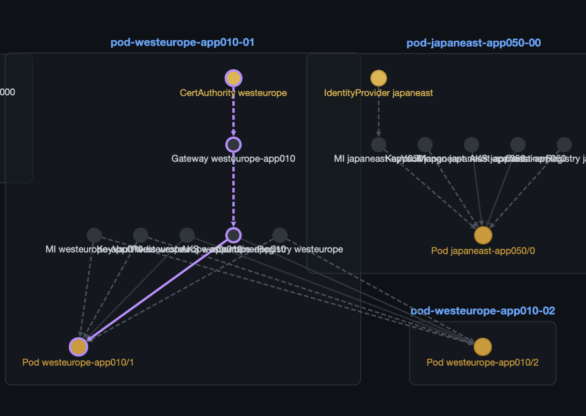
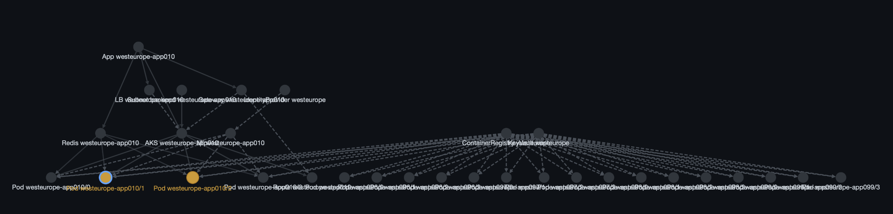

# Causinator 9000

*A reactive causal inference engine for cloud infrastructure.*

Given a dependency graph, deployment mutations, and degradation signals, the Causinator 9000 computes the probability that each recent change caused the observed symptoms and traces the causal path through the dependency DAG.

Built in Rust. Sub-2ms inference on a 26,000-node graph. Zero external dependencies beyond PostgreSQL.

## Table of Contents

- [How It Works](#how-it-works)
- [Architecture](#architecture)
- [The Inference Algorithm](#the-inference-algorithm)
- [Conditional Probability Tables (CPTs)](#conditional-probability-tables-cpts)
- [Temporal Decay](#temporal-decay)
- [Upstream Propagation](#upstream-propagation)
- [Latent Node Inference](#latent-node-inference)
- [Quick Start](#quick-start)
- [Running the Demo](#running-the-demo)
- [Web Dashboard](#web-dashboard)
- [API Reference](#api-reference)
- [Building CPTs](#building-cpts)
- [Project Structure](#project-structure)
- [Performance](#performance)
- [License](#license)

---

## How It Works

The Causinator 9000 maintains a **Causal Digital Twin** — a directed acyclic graph (DAG) where nodes are infrastructure resources (containers, gateways, key vaults, AKS clusters, etc.) and edges point from cause → effect (upstream → downstream dependency).

When a degradation signal arrives (error spike, heartbeat loss, memory pressure), the solver:

1. Walks the target node's **ancestor chain** upstream through the DAG
2. Finds all **mutations** (deployments, config changes, cert rotations) within the temporal window on those ancestors
3. Scores each candidate mutation using **likelihood-ratio Bayesian inference** against the node's CPT
4. Applies **temporal decay** — recent mutations get a higher causal prior
5. Applies **hop attenuation** — upstream mutations are discounted by 8% per dependency hop
6. Returns a ranked list of **competing causes** with confidence scores and causal paths

The solver never guesses. No mutations in the window → confidence = 0. No CPT match → weak signal. The system is designed to say "I don't know" rather than produce false positives.

## Architecture

```
Data Producers              Event Store              Inference Engine
─────────────              ───────────              ────────────────
Radius (deploys)    ──┐
Azure Monitor       ──┼──▶  PostgreSQL  ──CDC──▶  drasi-lib (embedded)
LLM Transpiler      ──┘     (WAL)                      │
                                                        ▼
                                                  Bayesian Solver
                                                  (LR inference)
                                                        │
                                              ┌─────────┼──────────┐
                                              ▼         ▼          ▼
                                          REST API   Web UI    Checkpoint
                                          (Axum)   (Cytoscape)  (bincode)
```

**Key design decisions:**

- **Single process.** The engine embeds [drasi-lib](https://github.com/drasi-project/drasi-core) in-process for zero-hop CDC event delivery. No sidecar, no message queue, no IPC.
- **PostgreSQL as the only integration point.** Data producers write SQL. Drasi watches the WAL. No custom protocols.
- **Subgraph-local inference.** Diagnosis activates ~10–20 ancestor nodes, not the full graph. Complexity is O(ancestors × active_mutations), not O(graph).

## The Inference Algorithm

For each candidate (mutation, signal) pair where a CPT entry matches:

**Likelihood Ratio:**

$$LR = \frac{P(\text{signal} \mid \text{mutation present})}{P(\text{signal} \mid \text{mutation absent})}$$

**Posterior via Bayes' theorem:**

$$P(\text{caused} \mid \text{signal}) = \frac{\text{prior odds} \times LR}{1 + \text{prior odds} \times LR}$$

**Worked example:** `ImageUpdate → CrashLoopBackOff`, CPT = [0.75, 0.03]:

```
LR = 0.75 / 0.03 = 25×
Starting prior = 0.50 (uninformative), prior_odds = 1.0
Posterior odds = 1.0 × 25 = 25
Posterior = 25/26 = 96.2%
```

This is asking: *"given that CrashLoopBackOff appeared after an ImageUpdate, how likely is the update to blame?"* — not "what's the background failure rate."

## Conditional Probability Tables (CPTs)

CPTs encode the relationship between mutation types and signal types for each resource class. They live in `config/heuristics.yaml`.

### Structure

```yaml
- class: <ResourceClass>
  default_prior:
    P_failure: <float>       # Background failure probability (not used in LR inference)
  cpts:
    - mutation: <MutationType>
      signal: <SignalType>
      table:
        - [P(signal_high | mutation_present), P(signal_high | mutation_absent)]
        - [P(signal_low  | mutation_present), P(signal_low  | mutation_absent)]
```

### How to Read a CPT

The table `[0.75, 0.03]` for `ImageUpdate → CrashLoopBackOff` means:

| | Mutation present | Mutation absent |
|---|---|---|
| **Signal observed** | 0.75 (75%) | 0.03 (3%) |
| **Signal not observed** | 0.25 (25%) | 0.97 (97%) |

The **likelihood ratio** is `0.75 / 0.03 = 25×`. Higher LR = stronger causal link.

### Guidelines for Writing CPTs

**High-confidence links (LR > 20×):**
```yaml
# A firmware update almost certainly causes heartbeat loss when it goes wrong
- mutation: FirmwareUpdate
  signal: heartbeat
  table:
    - [0.80, 0.001]    # LR = 800×
    - [0.20, 0.999]
```

**Moderate links (LR 5–20×):**
```yaml
# A config change often causes error rate spikes, but errors happen for other reasons too
- mutation: ConfigChange
  signal: error_rate
  table:
    - [0.65, 0.04]     # LR = 16.25×
    - [0.35, 0.96]
```

**Weak links (LR 2–5×):**
```yaml
# Scaling events sometimes cause memory pressure, but memory issues are common anyway
- mutation: ScaleEvent
  signal: memory_rss
  table:
    - [0.40, 0.08]     # LR = 5×
    - [0.60, 0.92]
```

**Rules of thumb:**
- Each row must sum to 1.0 (the two columns per row represent the same event conditional on mutation present/absent)
- `P(signal | mutation_present)` should always be ≥ `P(signal | mutation_absent)` — otherwise the mutation *prevents* the signal
- The ratio between the two top-row values is the likelihood ratio. This is the single most important number
- Start with LR ≈ 10× for typical cause-effect relationships and adjust based on domain knowledge
- LR > 100× should be reserved for near-certain causal links (firmware update → hard crash)
- LR < 3× means the signal barely distinguishes mutation-present from mutation-absent — consider whether the CPT entry is useful

### Iterating on CPTs: Eliminating Noise

CPTs aren't write-once. In practice, you'll refine them as you observe the solver's behavior on real traffic. The most important iteration is **identifying and suppressing transient failures** — signals that correlate with mutations but don't represent real incidents.

Common transient patterns:
- **Image pull rate limits:** DockerHub or a private registry rate-limits a pull during an automated deploy. The deploy fails, retries, and succeeds with the same image. The `ImageUpdate → ImagePullBackOff` signal is real but not actionable.
- **Health check timing:** A pod restarts during a rolling update and briefly fails its readiness probe. The signal is `CrashLoopBackOff` but it self-resolves within 60 seconds.
- **DNS propagation:** A config change updates a service's DNS entry. For a few seconds, some clients resolve the old address and report connection errors. Transient by definition.
- **Flapping alerts:** A metric oscillates around an alerting threshold, producing repeated fire/resolve cycles. Each one looks like a signal but none represent a real degradation.

**How to handle transients in CPTs:**

1. **Lower the LR.** If a mutation→signal pair fires frequently but rarely represents a real incident, reduce `P(signal | mutation)` to bring the LR down. An LR of 2–3× will produce a posterior of 65–75% — present in the output but not the top candidate if a stronger match exists.

2. **Raise the background rate.** If a signal type fires often regardless of mutations (flapping), increase `P(signal | no mutation)`. This acknowledges that the signal is noisy by nature.

3. **Split into transient vs. persistent variants.** If the same signal type can be transient or real depending on duration, create two CPT entries with different signal names:

```yaml
# Transient: pull failed once, retried successfully
- mutation: ImageUpdate
  signal: ImagePullBackOff_transient
  table:
    - [0.25, 0.15]    # LR = 1.7× — barely above noise
    - [0.75, 0.85]

# Persistent: pull failing repeatedly, image is actually broken
- mutation: ImageUpdate
  signal: ImagePullBackOff_persistent
  table:
    - [0.80, 0.02]    # LR = 40× — very likely the deploy broke it
    - [0.20, 0.98]
```

The classification of transient vs. persistent happens upstream — your signal ingestion pipeline decides which variant to record based on duration, retry success, or alert resolution time. The solver doesn't need to know about the heuristic; it just sees differently-named signal types with different CPTs.

4. **Review the golden tests.** After adjusting CPTs, run `python3 scripts/demo.py` and `python3 scripts/golden_tests.py` to verify you haven't degraded the solver's accuracy on scenarios that should still trigger.

The goal: over time, your CPTs converge toward a state where every diagnosis the solver produces is worth an operator's attention, and the transient noise that doesn't warrant investigation has been systematically classified out.

### Discovering Missing Latent Nodes

The other side of CPT iteration is recognizing when the graph is missing shared causes. This shows up as a distinctive pattern in your solver output: **multiple nodes failing simultaneously with no root cause identified**.

If you see 5 pods in the same cluster all throwing `ConnectionTimeout` at the same moment and the solver reports `confidence: 0.0` on each one individually (no mutations in the window), that's the solver telling you there's a shared cause it can't see. The independent-failure hypothesis is astronomically unlikely — 5 simultaneous timeout events that are truly unrelated — but the solver has no upstream node to attribute them to.

This is your signal to add a latent node:

1. **Identify the shared factor.** What do the failing nodes have in common? Same subnet? Same NAT gateway? Same service mesh sidecar version? Same shared database connection pool?

2. **Add the latent node and edges.** Add a new node representing the unobserved shared dependency and wire it to each affected node. You can do this by updating the topology in `scripts/transpile.py` or adding entries to the graph via the transpiler prompt. For a quick test, inject a mutation on the latent node via the API:

```bash
# Inject a mutation on the latent node (assumes the node exists in the graph)
rcie mutate --node latent-natgw-eastus-prod --mutation GatewayRestart
```

For permanent additions, add the node and edges to your transpiler output or synthetic topology generator so they're included in every graph rebuild.

3. **Add CPTs for the new class** (or reuse an existing one if the class already has CPTs). What mutations can happen on a NAT gateway? What signals would they produce?

```yaml
- class: SubnetGateway
  default_prior:
    P_failure: 0.001
  cpts:
    - mutation: GatewayRestart
      signal: ConnectionTimeout
      table:
        - [0.75, 0.03]    # LR = 25×
        - [0.25, 0.97]
```

4. **Re-run inference.** Next time those 5 pods time out simultaneously after a gateway restart, the solver walks upstream, finds the shared NAT gateway with the mutation, and reports a single root cause at ~90% confidence instead of 5 separate `0.0%` diagnoses.

**Common latent nodes to look for:**
- **Shared load balancers** — multiple services behind the same LB with no LB node in the graph
- **Service mesh control planes** — Istio/Linkerd control plane changes affect all sidecars
- **Shared database instances** — multiple apps using the same RDS/Cloud SQL instance
- **NAT gateways / egress IPs** — subnet-level networking that affects all pods in a VNet
- **Container registries** — a registry outage breaks image pulls for every service that depends on it
- **Shared secret stores** — a Vault/KMS rotation affects every service with cached credentials

The pattern is always the same: when you see correlated failures that the solver can't explain, you're looking at a missing node in the graph. Add it, wire it up, give it CPTs, and the solver starts explaining those correlations as what they are — shared causes, not coincidences.

### Included CPT Classes (22)

The POC ships with CPTs for: Container, VirtualMachine, ManagedIdentity, KeyVault, AKSCluster, RedisCache, SqlDatabase, LoadBalancer, VirtualNetwork, Gateway, HttpRoute, MessageQueue, ToRSwitch, AvailabilityZone, PowerDomain, SubnetGateway, Application, Environment, DNS, IdentityProvider, ContainerRegistry, CertAuthority, MongoDatabase, NetworkInterface.

## Temporal Decay

The causal prior decays exponentially with the time gap between mutation and signal:

$$\text{prior}(t) = 0.50 \times e^{-\lambda t}$$

where *t* = gap in minutes, λ = 0.055 (half-life ≈ 12.6 minutes).

| Gap | Prior | Posterior (LR=25) |
|---|---|---|
| 0 min | 0.50 | 96.2% |
| 5 min | 0.38 | 93.9% |
| 15 min | 0.22 | 87.6% |
| 25 min | 0.13 | 78.9% |
| 30 min | 0.10 | 73.5% |

A mutation at 2 minutes scores 92.9%. The same mutation at 25 minutes scores 70.2%. Same CPT, same LR — the time gap is the only difference.

## Upstream Propagation

When a mutation occurs on an upstream node (e.g., CertAuthority) and signals appear on downstream nodes (e.g., mTLS errors on pods), the solver traces the causal path through the DAG.

Three scoring strategies are evaluated per upstream mutation:
1. **Ancestor's own CPTs** applied to the observed signal type
2. **Ancestor's CPTs** applied to downstream signals
3. **Target's CPTs** matched against the mutation type

Highest score wins, then attenuated by **8% per hop** in the dependency path.

Example: `CertAuthority → Gateway → AKSCluster → Pod` (3 hops):
- CA's CPT for `CertificateRotation → mTLSHandshakeError`: LR = 42.5×
- 3-hop attenuation: × 0.92³ = 0.779
- Result: **77%** confidence with full causal path shown

## Latent Node Inference

The graph transpiler injects unobserved physical infrastructure nodes that don't appear in deployment templates but are critical for causal reasoning:

- **ToR Switches** — shared network fabric; explains correlated VM failures
- **Availability Zones** — physical isolation boundaries
- **Power Domains** — electrical fault domains
- **Subnet Gateways** — shared network paths
- **Platform Services** — DNS, certificate authorities, identity providers, container registries

Without latent nodes, 50 simultaneous VM failures appear as 50 independent events (P ≈ 0.001⁵⁰). With a latent ToR switch as their shared parent, the solver recognizes a single shared-cause hypothesis — the *explaining away* pattern.

---

## Quick Start

### Prerequisites

- **Rust** (1.85+ stable): `curl --proto '=https' --tlsv1.2 -sSf https://sh.rustup.rs | sh`
- **PostgreSQL** (15+): `brew install postgresql@17` (macOS) or your distro's package manager
- **Python 3.9+** with `requests`: `pip install requests`

### Setup

```bash
# Clone
git clone https://github.com/sylvainsf/rcie.git
cd rcie

# Start PostgreSQL (adjust port if needed)
export PATH="/opt/homebrew/opt/postgresql@17/bin:$PATH"  # macOS
pg_ctl -D /opt/homebrew/var/postgresql@17 start

# Create database and schema
createdb -p 5433 rcie_poc
psql -p 5433 rcie_poc -c "ALTER SYSTEM SET wal_level = 'logical';"
pg_ctl -D /opt/homebrew/var/postgresql@17 restart
psql -p 5433 rcie_poc < scripts/schema.sql
psql -p 5433 rcie_poc -c "SELECT pg_create_logical_replication_slot('drasi_slot', 'pgoutput');"
psql -p 5433 rcie_poc -c "CREATE PUBLICATION drasi_pub FOR ALL TABLES;"

# Generate synthetic topology (26k nodes, 52k edges)
python3 scripts/transpile.py --synthetic

# Build and start engine
cargo build --release
RUST_LOG=info ./target/release/rcie-engine

# In another terminal — verify
curl http://localhost:8080/health
```

### Running the Demo

```bash
# Interactive demo — walks through 10 scenarios with timing and color
python3 scripts/demo.py

# Seed some alerts for the web dashboard
python3 scripts/seed_alerts.py

# Open the dashboard
open http://localhost:8080/
```

### Stress Tests

```bash
# Run all 4 stress tests (fan-out, concurrent, large-window, flood)
python3 scripts/load_test.py

# Run a specific test
python3 scripts/load_test.py --test fan
python3 scripts/load_test.py --test concurrent
python3 scripts/load_test.py --test window
python3 scripts/load_test.py --test flood
```

---

## Web Dashboard

The engine serves a zero-build web dashboard at **http://localhost:8080/** when running. Built with [Cytoscape.js](https://js.cytoscape.org/) — a single HTML file, no npm, no build step.

### Alert Tree View

The default view shows only the nodes involved in active alerts, laid out as discrete causal trees using the `dagre` hierarchical layout. Each cluster represents one alert and its causal context — the affected node, its upstream ancestors, and the root cause path.



*Alert trees for 4 active incidents: a KeyVault secret rotation affecting 3 pods (1-hop), a CertAuthority rotation propagating through Gateway → AKS → Pod (3-hop), an IdentityProvider policy change (2-hop), and a direct ImageUpdate crash.*

**Node colors:**
- 🔴 **Red** — Alert: node has both an active signal and a matching mutation
- 🟠 **Orange** — Signal: node has a degradation signal but no mutation on it directly
- 🟡 **Yellow** — Mutation: node has a recent mutation but no signal (potential cause)
- ⚪ **Gray** — Normal: no active evidence

### Alert Cards

The left panel lists all active alerts as cards, sorted by confidence (default) or time. Each card shows the node ID, signal type, confidence bar, root cause attribution, and time since the alert fired.



*Alerts sorted by confidence: 96.2% ImageUpdate crash, 89.8% KeyVault rotation, 82.6% IdentityProvider change, 77.0% CertAuthority rotation.*

**Filtering:** Use the dropdowns above the alert list to filter by node class (Container, Gateway, KeyVault, etc.) or signal type (CrashLoopBackOff, TLSError, AccessDenied_403, etc.). Filters apply to both the card list and the graph view.

**Sorting:** Toggle between `Conf` (confidence descending) and `Time` (most recent first).

### Node Detail Panel

Clicking a node or alert card opens the detail panel on the right, showing:

- **Confidence score** with percentage
- **Root cause** — the mutation identified as the most likely cause
- **Causal path** — clickable chain from root cause to affected node (e.g., `ca-westeurope → appgw-westeurope-app010 → aks-westeurope-app010 → pod-westeurope-app010-01`)
- **Competing causes** — ranked alternatives with individual confidence bars
- **Show Neighborhood** button — switches to a detailed local subgraph view



*Detail panel showing a 3-hop causal path from CertAuthority through Gateway and AKS to the affected pod, with 77.0% confidence.*

### Neighborhood View

Click "Neighborhood" in the top bar or the "Show Neighborhood" button in the detail panel to see a 2-hop subgraph around the selected node, automatically laid out with the `dagre` algorithm. This view shows the full dependency context — upstream causes and downstream effects.



*Neighborhood view of pod-eastus-app001-00 showing its upstream dependencies: AKS cluster, KeyVault, ContainerRegistry, ManagedIdentity, and the application/subnet containment hierarchy.*

### Temporal Window Control

The temporal window (default: 30 minutes) controls how far back the solver looks for candidate mutations. Adjust it in real time using the input in the top bar — type a value in minutes and click "Set." The change takes effect immediately for all subsequent diagnoses.

### Dashboard Seeding

To populate the dashboard with sample alerts:

```bash
python3 scripts/seed_alerts.py
```

This injects 4 cross-boundary alert scenarios (KeyVault → pods, CertAuthority → Gateway → AKS → pods, IdentityProvider → ManagedIdentity → pods, and a direct deploy crash). Open http://localhost:8080/ to see the causal trees.

---

## API Reference

All endpoints are available under both `/api/` and root paths.

| Endpoint | Method | Description |
|---|---|---|
| `/api/health` | GET | Node/edge counts, active mutation/signal counts |
| `/api/diagnosis?target=<id>` | GET | Diagnose a node: confidence, root cause, causal path, competing causes |
| `/api/diagnosis/all` | GET | All active diagnoses above threshold |
| `/api/alerts` | GET | Active alerts with diagnosis, sorted by confidence |
| `/api/alert-graph` | GET | Cytoscape JSON of alert-affected subgraphs only |
| `/api/neighborhood?node=<id>&depth=2` | GET | Cytoscape JSON of node's local subgraph |
| `/api/graph/{island}` | GET | Full graph as Cytoscape JSON |
| `/api/mutations` | POST | Inject a mutation: `{"node_id": "...", "mutation_type": "..."}` |
| `/api/signals` | POST | Inject a signal: `{"node_id": "...", "signal_type": "...", "severity": "..."}` |
| `/api/clear` | POST | Clear all active mutations and signals |

### Example: Inject and Diagnose

```bash
# Inject a mutation
curl -X POST http://localhost:8080/api/mutations \
  -H 'Content-Type: application/json' \
  -d '{"node_id": "pod-eastus-app042-01", "mutation_type": "ImageUpdate"}'

# Inject a signal
curl -X POST http://localhost:8080/api/signals \
  -H 'Content-Type: application/json' \
  -d '{"node_id": "pod-eastus-app042-01", "signal_type": "CrashLoopBackOff", "severity": "critical"}'

# Diagnose
curl 'http://localhost:8080/api/diagnosis?target=pod-eastus-app042-01' | python3 -m json.tool
```

Response:
```json
{
    "target_node": "pod-eastus-app042-01",
    "confidence": 0.962,
    "root_cause": "pod-eastus-app042-01 (ImageUpdate)",
    "causal_path": ["pod-eastus-app042-01"],
    "competing_causes": [
        ["pod-eastus-app042-01 (ImageUpdate)", 0.962]
    ],
    "timestamp": "2026-03-06T..."
}
```

---

## Building CPTs

### Heuristic Registry Layout

RCIE ships heuristics as a **modular, layered registry**. The default configuration uses a **manifest file** (`config/heuristics.manifest.yaml`) that lists layer files to load in order:

```yaml
# config/heuristics.manifest.yaml
layers:
  - path: heuristics/containers.yaml        # Container, ContainerRegistry, AKSCluster
  - path: heuristics/compute.yaml           # VirtualMachine
  - path: heuristics/networking.yaml        # VirtualNetwork, SubnetGateway, NetworkInterface, DNS
  - path: heuristics/routing.yaml           # LoadBalancer, Gateway, HttpRoute
  - path: heuristics/databases.yaml         # SqlDatabase, MongoDatabase, RedisCache
  - path: heuristics/identity.yaml          # ManagedIdentity, KeyVault, IdentityProvider, CertAuthority
  - path: heuristics/messaging.yaml         # MessageQueue
  - path: heuristics/physical-infra.yaml    # ToRSwitch, AvailabilityZone, PowerDomain
  - path: heuristics/applications.yaml      # Application, Environment
  - path: heuristics/private.yaml           # Your private overrides (optional)
    optional: true
```

**Key concepts:**

| Feature | Behavior |
|---|---|
| **Multiple files** | Each `layers` entry is a separate YAML file loaded in order |
| **Most-specific override** | Later layers override earlier ones at CPT granularity — keyed by `(class, mutation, signal)` |
| **Lean patching** | An override file only needs the fields it wants to change; everything else is inherited |
| **Optional layers** | Layers with `optional: true` are silently skipped when absent |
| **Backward compatible** | Setting `RCIE_HEURISTICS` to a flat YAML list (the old format) still works — the format is auto-detected |

**Example lean patch** — override a single weight without touching anything else:

```yaml
# config/heuristics/private.yaml
- class: Container
  cpts:
    - mutation: ImageUpdate
      signal: CrashLoopBackOff
      table:
        - [0.85, 0.03]   # Increased from 0.75 based on internal incident data
        - [0.15, 0.97]
```

See `config/heuristics/private.yaml.example` for more examples including prior overrides and adding brand-new classes.

> **Environment variable:** `RCIE_HEURISTICS` controls which file to load. Defaults to `config/heuristics.manifest.yaml`. Set it to `config/heuristics.yaml` (the original flat file) for backward compatibility.

### Step 1: Identify the Resource Class

What type of infrastructure is this? Container, Gateway, KeyVault, AKSCluster, etc. Each class gets its own CPT block in one of the layer files under `config/heuristics/` (or in `config/heuristics.yaml` if using the flat format).

### Step 2: List Mutation→Signal Pairs

For each class, what changes can happen and what symptoms do they produce?

| Resource | Mutation | Expected Signal | Reasoning |
|---|---|---|---|
| Container | ImageUpdate | CrashLoopBackOff | New code may crash |
| Container | ImageUpdate | memory_rss | New code may leak memory |
| Container | ConfigChange | error_rate | Misconfigured env vars |
| Gateway | CertificateRotation | TLSError | Cert mismatch breaks TLS |
| KeyVault | SecretRotation | AccessDenied_403 | Apps using cached/old secrets |
| AKSCluster | KubernetesUpgrade | PodEviction | Nodes drain during upgrade |

### Step 3: Estimate the Probabilities

For each pair, estimate two values:

- **P(signal | mutation present):** If this mutation happened and caused a problem, how likely would we see this signal? (0.0 – 1.0)
- **P(signal | mutation absent):** How likely is this signal from background noise / other causes? (usually 0.01 – 0.10)

The ratio of these two values is the **likelihood ratio** — the single most important number in the CPT.

### Step 4: Write the YAML

```yaml
- class: MyNewService
  default_prior:
    P_failure: 0.003    # Background failure rate (informational)
  cpts:
    - mutation: SchemaChange
      signal: query_timeout
      table:
        - [0.70, 0.05]  # LR = 14×  — strong link
        - [0.30, 0.95]
    - mutation: ConnectionPoolResize
      signal: latency_spike
      table:
        - [0.45, 0.08]  # LR = 5.6× — moderate link
        - [0.55, 0.92]
```

### Step 5: Validate with the Demo

Run the demo or inject events via the API to verify the CPT produces expected confidence scores. The `golden_tests.py` script can be extended with custom scenarios.

---

## Project Structure

```
rcie/
├── Cargo.toml                          # Workspace: rcie-engine, rcie-cli
├── config/
│   ├── heuristics.manifest.yaml        # Manifest listing heuristic layers to load
│   ├── heuristics.yaml                 # Flat CPT file (legacy / backward compat)
│   └── heuristics/
│       ├── containers.yaml            # Container, ContainerRegistry, AKSCluster
│       ├── compute.yaml               # VirtualMachine
│       ├── networking.yaml            # VirtualNetwork, SubnetGateway, NIC, DNS
│       ├── routing.yaml               # LoadBalancer, Gateway, HttpRoute
│       ├── databases.yaml             # SqlDatabase, MongoDatabase, RedisCache
│       ├── identity.yaml              # ManagedIdentity, KeyVault, IdP, CertAuthority
│       ├── messaging.yaml             # MessageQueue
│       ├── physical-infra.yaml        # ToRSwitch, AvailabilityZone, PowerDomain
│       ├── applications.yaml          # Application, Environment
│       └── private.yaml.example       # Example private override layer
├── prompts/
│   └── transpiler.md                   # LLM prompt for ARM JSON → graph SQL
├── scripts/
│   ├── schema.sql                      # PostgreSQL schema
│   ├── transpile.py                    # Graph transpiler (LLM or synthetic)
│   ├── demo.py                         # Interactive 10-scenario demo
│   ├── load_test.py                    # 4-test stress suite
│   ├── golden_tests.py                 # Correctness validation
│   ├── seed_alerts.py                  # Seed dashboard with sample alerts
│   ├── smoke_test.py                   # Quick pipeline test
│   ├── load_generator.py               # Signal flood generator
│   ├── radius_receiver.py              # Radius webhook → PG
│   └── monitor_receiver.py             # Azure Monitor webhook → PG
├── crates/
│   ├── rcie-engine/                    # Main service
│   │   └── src/
│   │       ├── main.rs                 # Startup, Drasi init, API launch
│   │       ├── solver/mod.rs           # LR inference, temporal decay, diagnosis
│   │       ├── solver/ve.rs            # Variable elimination (available, not primary)
│   │       ├── api/mod.rs              # REST + static file serving
│   │       ├── drasi/mod.rs            # drasi-lib integration
│   │       └── checkpoint/mod.rs       # Bincode state persistence
│   └── rcie-cli/                       # CLI binary
│       └── src/main.rs
├── web/
│   └── index.html                      # Cytoscape.js dashboard (zero-build)
├── spec.md                             # Full engineering specification
└── blog.md                             # "Why causation, not correlation" writeup
```

## Performance

| Metric | Value |
|---|---|
| Graph | 26,180 nodes / 52,110 edges |
| Inference p50 | 1.2 ms |
| Inference p95 | 1.6 ms |
| Concurrent throughput | 2,186 queries/sec (8 threads) |
| Fan-out (1 mutation → 100 diagnoses) | p95 = 2.5 ms |
| Active window (20k events) | p95 = 1.0 ms |
| Sustained flood (inject + diagnose) | p95 = 1.3 ms, 1,042 diag/s |

Inference is O(ancestors × active_mutations), not O(graph). Adding 16,000 nodes had zero measurable impact on latency.

## License

MIT License

Copyright (c) 2026 Sylvain Niles

Permission is hereby granted, free of charge, to any person obtaining a copy of this software and associated documentation files (the "Software"), to deal in the Software without restriction, including without limitation the rights to use, copy, modify, merge, publish, distribute, sublicense, and/or sell copies of the Software, and to permit persons to whom the Software is furnished to do so, subject to the following conditions:

The above copyright notice and this permission notice shall be included in all copies or substantial portions of the Software.

THE SOFTWARE IS PROVIDED "AS IS", WITHOUT WARRANTY OF ANY KIND, EXPRESS OR IMPLIED, INCLUDING BUT NOT LIMITED TO THE WARRANTIES OF MERCHANTABILITY, FITNESS FOR A PARTICULAR PURPOSE AND NONINFRINGEMENT. IN NO EVENT SHALL THE AUTHORS OR COPYRIGHT HOLDERS BE LIABLE FOR ANY CLAIM, DAMAGES OR OTHER LIABILITY, WHETHER IN AN ACTION OF CONTRACT, TORT OR OTHERWISE, ARISING FROM, OUT OF OR IN CONNECTION WITH THE SOFTWARE OR THE USE OR OTHER DEALINGS IN THE SOFTWARE.
