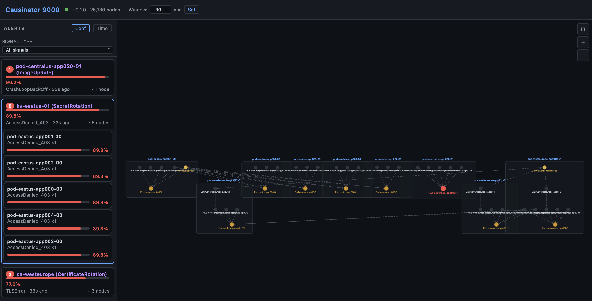

# Causinator 9000

*A reactive causal inference engine for cloud infrastructure.*

Given a dependency graph, deployment **mutations** (changes to infrastructure), and degradation **signals** (observed symptoms), the Causinator 9000 computes the probability that each recent change caused the observed symptoms and traces the causal path through the dependency DAG (directed acyclic graph).

Built in Rust. Sub-2ms inference on a 26,000-node graph. Zero external dependencies beyond PostgreSQL.

## Table of Contents

- [How It Works](#how-it-works)
- [Architecture](#architecture)
- [Quick Start](#quick-start)
- [Data Sources](#data-sources)
- [Web Dashboard](#web-dashboard)
- [CPTs and Inference](#cpts-and-inference)
- [Alert Rules](#alert-rules)
- [API Reference](#api-reference)
- [Project Structure](#project-structure)
- [Performance](#performance)
- [Documentation](#documentation)
- [License](#license)

---

## How It Works

The Causinator 9000 maintains a **Causal Digital Twin** — a directed acyclic graph (DAG) where nodes are infrastructure resources (containers, gateways, key vaults, AKS clusters, etc.) and edges point from cause → effect (upstream → downstream dependency).

When a degradation **signal** arrives (error spike, heartbeat loss, memory pressure), the solver:

1. Walks the target node's **ancestor chain** upstream through the DAG
2. Finds all **mutations** (deployments, config changes, cert rotations) within the temporal window on those ancestors
3. Scores each candidate mutation using **likelihood-ratio (LR) Bayesian inference** against the node's **CPT** (Conditional Probability Table — a lookup table encoding how likely each mutation type is to produce each signal type)
4. Applies **temporal decay** — recent mutations get a higher causal prior; each resource class has its own decay rate
5. Applies **hop attenuation** — upstream mutations are discounted by 8% per dependency hop
6. Returns a ranked list of **competing causes** with confidence scores and causal paths

The solver never guesses. No mutations in the window → confidence = 0. No CPT match → weak signal. The system is designed to say "I don't know" rather than produce false positives.

## Architecture

```
Data Producers              Event Store              Inference Engine
─────────────              ───────────              ────────────────
Radius (deploys)    ──┐
Azure Monitor       ──┼──▶  PostgreSQL  ──CDC──▶  drasi-lib (embedded)
LLM Transpiler      ──┘     (WAL)                      │
                                                        ▼
                                                  Bayesian Solver
                                                  (LR inference)
                                                        │
                                              ┌─────────┼──────────┐
                                              ▼         ▼          ▼
                                          REST API   Web UI    Checkpoint
                                          (Axum)   (Cytoscape)  (bincode)
```

**Key design decisions:**

- **Single process.** The engine embeds [drasi-lib](https://github.com/drasi-project/drasi-core) in-process for zero-hop CDC event delivery. No sidecar, no message queue, no IPC.
- **PostgreSQL as the only integration point.** Data producers write SQL. Drasi watches the WAL. No custom protocols.
- **Subgraph-local inference.** Diagnosis activates ~10–20 ancestor nodes, not the full graph. Complexity is O(ancestors × active_mutations), not O(graph).

## The Inference Algorithm

Uses **likelihood-ratio (LR) Bayesian inference**: for each (mutation, signal) pair, computes $LR = P(signal \mid mutation) / P(signal \mid no\\ mutation)$ from the resource's **CPT** (Conditional Probability Table), then updates a causal prior via Bayes' theorem. An `ImageUpdate → CrashLoopBackOff` CPT of [0.75, 0.03] gives LR = 25× → 96.2% posterior confidence.

Key features:
- **Per-class temporal decay** — recent mutations score higher; each resource class has its own half-life (Container: 15 min, DNS: 360 min, DenyPolicy: 30 days)
- **Upstream propagation** — traces mutations through the DAG with 8% hop attenuation
- **Competing causes** — ranks multiple candidate mutations; **latent nodes** (unobserved shared dependencies like GHCR, Azure OIDC, flaky test infrastructure) compete with code changes
- **Explaining away** — correlated failures on shared infrastructure converge to a single root cause

→ [Full inference documentation](docs/inference.md)

## Data Sources

The engine ingests topology, mutations, and signals from multiple sources:

| Source | What it provides | Command |
|--------|-----------------|---------|
| Azure Resource Graph | Infrastructure topology (VMs, NICs, AKS, KV, etc.) | `make ingest-arg` |
| Azure Resource Changes | ARM-level mutations (config changes, scale events) | `make ingest-azure-health` |
| Azure Resource Health | Degraded/Unavailable signals | `make ingest-azure-health` |
| Azure Policy | Deny policy latent nodes + violations | `make ingest-azure-policy` |
| GitHub Actions | CI failures as classified signals, commits as mutations | `make ingest-gh` |
| Kubernetes | Pod topology + events (CrashLoopBackOff, OOMKilled, etc.) | `make ingest-k8s` |
| Terraform State | HCL resources + dependency edges | `make ingest-tf` |

Real-time receivers: `make webhook-gh` (GH webhook :8090), `make webhook-azure` (Event Grid :8091), `make watch-k8s` (K8s event stream).

Full pipeline: `make ingest-all`

→ [Data sources reference](docs/data-sources.md)

## CPTs and Inference

**Conditional Probability Tables (CPTs)** encode causal relationships between mutations and signals. Each CPT entry says: "if this mutation happened, how likely is this signal? And how likely is the signal without the mutation?" The ratio of these two values is the **likelihood ratio (LR)** — the core number driving inference.

CPTs are organized as modular YAML layers in `config/heuristics/`:

```yaml
- class: Container
  default_prior:
    P_failure: 0.002
    decay_half_life_minutes: 15
  cpts:
    - mutation: ImageUpdate
      signal: CrashLoopBackOff
      table:
        - [0.75, 0.03]    # LR = 25× → 96.2% confidence
        - [0.25, 0.97]
```

**30 resource classes** across 12 YAML files, covering Azure infrastructure, CI/CD pipelines, Kubernetes, and project-specific overrides. Add your own via `config/heuristics/private.yaml`.

→ [CPT reference](docs/cpts.md) · [Inference algorithm](docs/inference.md)

## Alert Rules

Permanent alert suppression via `config/alert-rules.yaml`:

```yaml
rules:
  - signal_type: ChecklistMissing
    action: suppress
    reason: "Shown in PR UI — not an infrastructure concern"
  - max_confidence: 0.05
    action: low
    reason: "Below 5% — background noise"
```

Match on signal type, resource class, node ID pattern (regex), confidence range. UI dismiss button for runtime suppression.

→ [Alert rules reference](docs/alert-rules.md)

## Quick Start

### Prerequisites

- **Rust** (1.85+ stable): `curl --proto '=https' --tlsv1.2 -sSf https://sh.rustup.rs | sh`
- **PostgreSQL** (15+): `brew install postgresql@17` (macOS) or your distro's package manager
- **Python 3.9+** with `requests`: `pip install requests`

### Setup

```bash
# Clone
git clone https://github.com/sylvainsf/causinator9000.git
cd causinator9000

# Start PostgreSQL (adjust port if needed)
export PATH="/opt/homebrew/opt/postgresql@17/bin:$PATH"  # macOS
pg_ctl -D /opt/homebrew/var/postgresql@17 start

# Create database and schema
createdb -p 5433 c9k_poc
psql -p 5433 c9k_poc -c "ALTER SYSTEM SET wal_level = 'logical';"
pg_ctl -D /opt/homebrew/var/postgresql@17 restart
psql -p 5433 c9k_poc < scripts/schema.sql
psql -p 5433 c9k_poc -c "SELECT pg_create_logical_replication_slot('drasi_slot', 'pgoutput');"
psql -p 5433 c9k_poc -c "CREATE PUBLICATION drasi_pub FOR ALL TABLES;"

# Generate synthetic topology (26k nodes, 52k edges)
python3 scripts/transpile.py --synthetic

# Build and start engine
cargo build --release
RUST_LOG=info ./target/release/c9k-engine

# In another terminal — verify
curl http://localhost:8080/health
```

### Running the Demo

```bash
# Interactive demo — walks through 10 scenarios with timing and color
python3 scripts/demo.py

# Seed some alerts for the web dashboard
python3 scripts/seed_alerts.py

# Open the dashboard
open http://localhost:8080/
```

### Stress Tests

```bash
# Rust-native stress tests (recommended — 10× faster than Python)
cargo run --release --bin c9k-load-test
cargo run --release --bin c9k-load-test -- --test fan --fan-pods 200
cargo run --release --bin c9k-load-test -- --test concurrent --threads 64

# Scale + memory test
cargo run --release --bin c9k-scale-test
cargo run --release --bin c9k-scale-test -- --preset multi-region

# Legacy Python stress tests (still functional)
python3 scripts/load_test.py
```

---

## Web Dashboard

The engine serves a zero-build web dashboard at **http://localhost:8080/** when running. Built with [Cytoscape.js](https://js.cytoscape.org/) — a single HTML file, no npm, no build step.

### Alert Tree View

The default view shows only the nodes involved in active alerts, laid out as discrete causal trees using the `dagre` hierarchical layout. Each cluster represents one alert and its causal context — the affected node, its upstream ancestors, and the root cause path.


*Alert trees for 4 active incidents: a KeyVault secret rotation affecting 3 pods (1-hop), a CertAuthority rotation propagating through Gateway → AKS → Pod (3-hop), an IdentityProvider policy change (2-hop), and a direct ImageUpdate crash.*

**Node colors:**
- 🔴 **Red** — Alert: node has both an active signal and a matching mutation
- 🟠 **Orange** — Signal: node has a degradation signal but no mutation on it directly
- 🟡 **Yellow** — Mutation: node has a recent mutation but no signal (potential cause)
- ⚪ **Gray** — Normal: no active evidence

### Alert Cards

The left panel lists all active alerts as cards, sorted by confidence (default) or time. Each card shows the node ID, signal type, confidence bar, root cause attribution, and time since the alert fired.


*Alerts sorted by confidence: 96.2% ImageUpdate crash, 89.8% KeyVault rotation, 82.6% IdentityProvider change, 77.0% CertAuthority rotation.*

**Filtering:** Use the dropdowns above the alert list to filter by node class (Container, Gateway, KeyVault, etc.) or signal type (CrashLoopBackOff, TLSError, AccessDenied_403, etc.). Filters apply to both the card list and the graph view.

**Sorting:** Toggle between `Conf` (confidence descending) and `Time` (most recent first).

### Node Detail Panel

Clicking a node or alert card opens the detail panel on the right, showing:

- **Confidence score** with percentage
- **Root cause** — the mutation identified as the most likely cause
- **Causal path** — clickable chain from root cause to affected node (e.g., `ca-westeurope → appgw-westeurope-app010 → aks-westeurope-app010 → pod-westeurope-app010-01`)
- **Competing causes** — ranked alternatives with individual confidence bars
- **Show Neighborhood** button — switches to a detailed local subgraph view


*Detail panel showing a 3-hop causal path from CertAuthority through Gateway and AKS to the affected pod, with 77.0% confidence.*

### Neighborhood View

Click "Neighborhood" in the top bar or the "Show Neighborhood" button in the detail panel to see a 2-hop subgraph around the selected node, automatically laid out with the `dagre` algorithm. This view shows the full dependency context — upstream causes and downstream effects.


*Neighborhood view of pod-eastus-app001-00 showing its upstream dependencies: AKS cluster, KeyVault, ContainerRegistry, ManagedIdentity, and the application/subnet containment hierarchy.*

### Alert Groups

When multiple alerts share a common root cause, the dashboard collapses them into **incident groups** — one per root cause — with a count badge and expandable member list.

The critical insight: **grouping is by root cause, not by signal type.** Consider two services on the same AKS cluster, both returning `HTTP_500` within a 5-minute window. Traditional monitoring sees "elevated 500s" and creates one big incident. The engine looks upstream and identifies two completely independent root causes:

- **Group A** (4 pods): `ds-centralus-app015` — the managed disk backing app015's SQL database went read-only (`BlockDeviceReadOnly`). All pods querying that store start 500ing. → Storage team.
- **Group B** (4 pods): `aks-centralus-app016` — a deployment pushed a new container image with a bug (`Deployment`). All pods restart with the bad code and 500. → Dev team rollback.

Same symptom. Different causes. Different response teams. Naive signal-type grouping merges them into one incident, hiding the fact that two independent failures need two independent responses.



*8 HTTP_500 alerts from 2 simultaneous incidents, correctly separated into 2 groups. Both groups show the same signal type — the engine distinguishes them by tracing each pod's 500 upstream through the causal graph to find the actual root cause.*

To seed the alert groups demo:

```bash
python3 scripts/screenshot_data.py
```

### Temporal Window Control

The temporal window (default: 24 hours) controls how far back the solver looks for candidate mutations. Adjust it in real time using the input in the top bar — type a value in minutes and click "Set." The change takes effect immediately for all subsequent diagnoses.

### Dashboard Seeding

To populate the dashboard with sample alerts:

```bash
python3 scripts/seed_alerts.py
```

This injects 4 cross-boundary alert scenarios (KeyVault → pods, CertAuthority → Gateway → AKS → pods, IdentityProvider → ManagedIdentity → pods, and a direct deploy crash). Open http://localhost:8080/ to see the causal trees.

---

## API Reference

All endpoints are available under both `/api/` and root paths.

| Endpoint | Method | Description |
|---|---|---|
| `/api/health` | GET | Node/edge counts, active mutation/signal counts |
| `/api/diagnosis?target=<id>` | GET | Diagnose a node: confidence, root cause, causal path, competing causes |
| `/api/diagnosis/all` | GET | All active diagnoses above threshold |
| `/api/alerts` | GET | Active alerts with diagnosis, sorted by confidence |
| `/api/alert-graph` | GET | Cytoscape JSON of alert-affected subgraphs only |
| `/api/neighborhood?node=<id>&depth=2` | GET | Cytoscape JSON of node's local subgraph |
| `/api/graph/{island}` | GET | Full graph as Cytoscape JSON |
| `/api/graph/load` | POST | Load a complete graph from JSON (`{"nodes": [...], "edges": [...]}`) |
| `/api/graph/export` | GET | Export the current graph as structured JSON |
| `/api/mutations` | POST | Inject a mutation: `{"node_id": "...", "mutation_type": "..."}` |
| `/api/signals` | POST | Inject a signal: `{"node_id": "...", "signal_type": "...", "severity": "..."}` |
| `/api/clear` | POST | Clear all active mutations and signals |
| `/api/reload-cpts` | POST | Hot-reload CPTs from disk without restart |
| `/api/window` | GET/POST | Get or set temporal window in minutes (`{"minutes": 1440}`) |
| `/api/memory` | GET | Solver memory info: node/edge/index counts |

### Example: Inject and Diagnose

```bash
# Inject a mutation
curl -X POST http://localhost:8080/api/mutations \
  -H 'Content-Type: application/json' \
  -d '{"node_id": "pod-eastus-app042-01", "mutation_type": "ImageUpdate"}'

# Inject a signal
curl -X POST http://localhost:8080/api/signals \
  -H 'Content-Type: application/json' \
  -d '{"node_id": "pod-eastus-app042-01", "signal_type": "CrashLoopBackOff", "severity": "critical"}'

# Diagnose
curl 'http://localhost:8080/api/diagnosis?target=pod-eastus-app042-01' | python3 -m json.tool
```

Response:
```json
{
    "target_node": "pod-eastus-app042-01",
    "confidence": 0.962,
    "root_cause": "pod-eastus-app042-01 (ImageUpdate)",
    "causal_path": ["pod-eastus-app042-01"],
    "competing_causes": [
        ["pod-eastus-app042-01 (ImageUpdate)", 0.962]
    ],
    "timestamp": "2026-03-06T..."
}
```

---

## Project Structure

```
causinator9000/
├── Cargo.toml                          # Workspace: c9k-engine, c9k-cli
├── config/
│   ├── heuristics.manifest.yaml        # Manifest listing heuristic layers to load
│   ├── heuristics.yaml                 # Flat CPT file (legacy / backward compat)
│   └── heuristics/
│       ├── containers.yaml            # Container, ContainerRegistry, AKSCluster
│       ├── compute.yaml               # VirtualMachine
│       ├── networking.yaml            # VirtualNetwork, SubnetGateway, NIC, DNS
│       ├── routing.yaml               # LoadBalancer, Gateway, HttpRoute
│       ├── databases.yaml             # SqlDatabase, MongoDatabase, RedisCache
│       ├── identity.yaml              # ManagedIdentity, KeyVault, IdP, CertAuthority
│       ├── messaging.yaml             # MessageQueue
│       ├── physical-infra.yaml        # ToRSwitch, AvailabilityZone, PowerDomain
│       ├── applications.yaml          # Application, Environment
│       └── private.yaml.example       # Example private override layer
├── prompts/
│   └── transpiler.md                   # LLM prompt for ARM JSON → graph SQL
├── scripts/
│   ├── schema.sql                      # PostgreSQL schema
│   ├── transpile.py                    # Graph transpiler (LLM or synthetic)
│   ├── demo.py                         # Interactive 10-scenario demo
│   ├── load_test.py                    # 4-test stress suite
│   ├── golden_tests.py                 # Correctness validation
│   ├── seed_alerts.py                  # Seed dashboard with sample alerts
│   ├── screenshot_data.py              # Seed alert-groups screenshot demo
│   ├── smoke_test.py                   # Quick pipeline test
│   ├── load_generator.py               # Signal flood generator
│   ├── radius_receiver.py              # Radius webhook → PG
│   └── monitor_receiver.py             # Azure Monitor webhook → PG
├── crates/
│   ├── c9k-engine/                    # Main service
│   │   └── src/
│   │       ├── main.rs                 # Startup, Drasi init, API launch
│   │       ├── solver/mod.rs           # LR inference, temporal decay, diagnosis
│   │       ├── solver/ve.rs            # Variable elimination (available, not primary)
│   │       ├── api/mod.rs              # REST + static file serving
│   │       ├── drasi/mod.rs            # drasi-lib integration
│   │       ├── lib.rs                  # Library re-exports for test crates
│   │       └── checkpoint/mod.rs       # Bincode state persistence
│   ├── c9k-cli/                       # CLI binary (CPT management, diagnosis, graph ops)
│   │   └── src/main.rs
│   └── c9k-tests/                     # Rust test suite + load test binaries
│       └── src/
│           ├── lib.rs                  # Test client, latency stats
│           ├── topology.rs             # Programmatic topology builder (any scale)
│           └── bin/
│               ├── load_test.rs        # 4-test stress suite (Rust, 44k qps)
│               └── scale_test.rs       # Memory + latency scaling test
├── web/
│   └── index.html                      # Cytoscape.js dashboard (zero-build)
└── docs/
    └── screenshots/                    # Dashboard screenshots for README
```

## Performance

### Inference Latency

Inference is O(ancestors × active_mutations), not O(graph). Graph size affects memory and load time, but has **zero impact** on diagnosis speed.

| Graph Scale | Nodes | Edges | p50 | p95 | RSS |
|---|---|---|---|---|---|
| Tiny (1 rack) | 203 | 425 | 0.15 ms | 0.23 ms | 35 MB |
| Standard (10 regions) | 26,270 | 49,490 | 0.14 ms | 0.21 ms | 84 MB |
| Azure Region (150 racks, 500 apps) | 45,167 | 61,155 | 0.13 ms | 0.23 ms | 190 MB |
| **5 Azure Regions** | **225,835** | **305,775** | **0.15 ms** | **0.21 ms** | **611 MB** |

Diagnosis latency stays at ~0.2 ms (200 microseconds) from 200 nodes to 225,000 nodes.

### Stress Tests (Rust)

```bash
# All 4 stress tests
cargo run --release --bin c9k-load-test

# Scale test — progressive topology scaling with memory measurement
cargo run --release --bin c9k-scale-test

# Multi-region scale test (1-5 Azure production regions, up to 225k nodes)
cargo run --release --bin c9k-scale-test -- --preset multi-region
```

| Test | Result |
|---|---|
| Fan-out (1 mutation → 200 pods) | p95 = 0.2 ms, all 200 traced to shared KeyVault |
| Concurrent (64 threads × 1000 queries) | p95 = 1.7 ms, **44,168 qps** |
| Large window (20k active events) | p95 = 0.4 ms |
| Sustained flood (30s inject + diagnose) | p95 = 1.5 ms, 3,203 diag/s |
| Memory scaling | ~2.7 KB/node — 225k nodes fits in 611 MB |

### Topology Builder

Generate realistic Azure infrastructure topologies at any scale — pure Rust, no SQL, no files:

```rust
use c9k_tests::topology::TopologyBuilder;

// Standard POC (~26k nodes)
let graph = TopologyBuilder::standard().build();

// Single Azure production region (~45k nodes)
let graph = TopologyBuilder::azure_region().build();

// 5 Azure regions (~225k nodes)
let graph = TopologyBuilder::azure_multi_region(5).build();

// Custom
let graph = TopologyBuilder::new()
    .regions(3)
    .racks_per_region(50)
    .vms_per_rack(20)
    .apps_per_region(200)
    .pods_per_app(6)
    .build();

// Load directly via API
client.post("/api/graph/load").json(&graph).send().await?;
```

## Documentation

| Document | Description |
|----------|-------------|
| [Inference Algorithm](docs/inference.md) | Likelihood-ratio math, temporal decay, upstream propagation, competing causes |
| [CPT Reference](docs/cpts.md) | CPT format, writing guidelines, P_failure calibration, layer system, all 30 classes |
| [Data Sources](docs/data-sources.md) | All source adapters, mutation/signal types, node ID conventions |
| [Alert Rules](docs/alert-rules.md) | Suppression config, match fields, runtime dismiss API |

## License

MIT License

Copyright (c) 2026 Sylvain Niles

Permission is hereby granted, free of charge, to any person obtaining a copy of this software and associated documentation files (the "Software"), to deal in the Software without restriction, including without limitation the rights to use, copy, modify, merge, publish, distribute, sublicense, and/or sell copies of the Software, and to permit persons to whom the Software is furnished to do so, subject to the following conditions:

The above copyright notice and this permission notice shall be included in all copies or substantial portions of the Software.

THE SOFTWARE IS PROVIDED "AS IS", WITHOUT WARRANTY OF ANY KIND, EXPRESS OR IMPLIED, INCLUDING BUT NOT LIMITED TO THE WARRANTIES OF MERCHANTABILITY, FITNESS FOR A PARTICULAR PURPOSE AND NONINFRINGEMENT. IN NO EVENT SHALL THE AUTHORS OR COPYRIGHT HOLDERS BE LIABLE FOR ANY CLAIM, DAMAGES OR OTHER LIABILITY, WHETHER IN AN ACTION OF CONTRACT, TORT OR OTHERWISE, ARISING FROM, OUT OF OR IN CONNECTION WITH THE SOFTWARE OR THE USE OR OTHER DEALINGS IN THE SOFTWARE.
