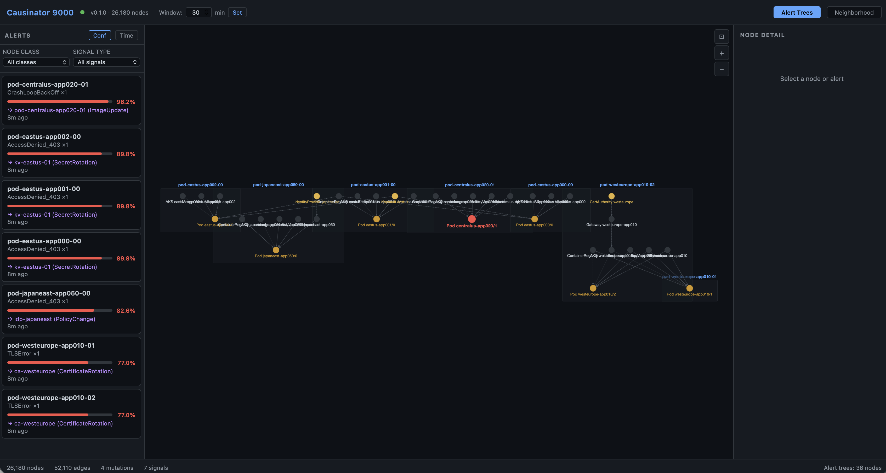
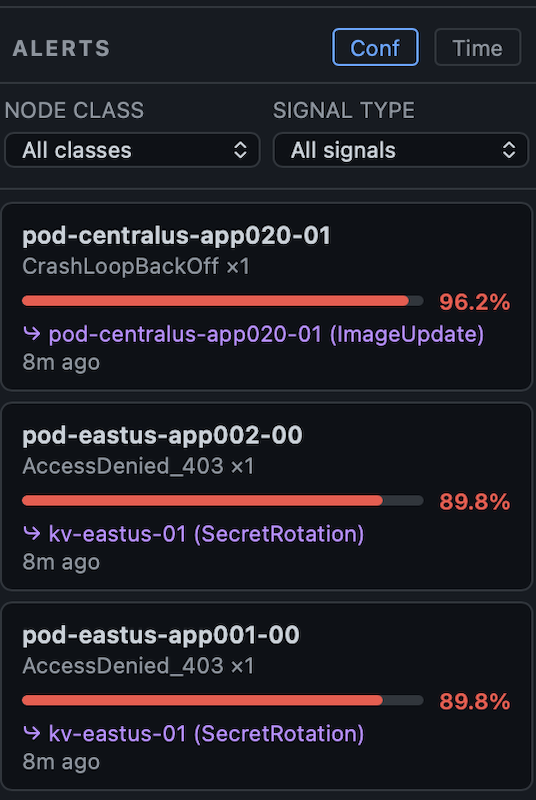
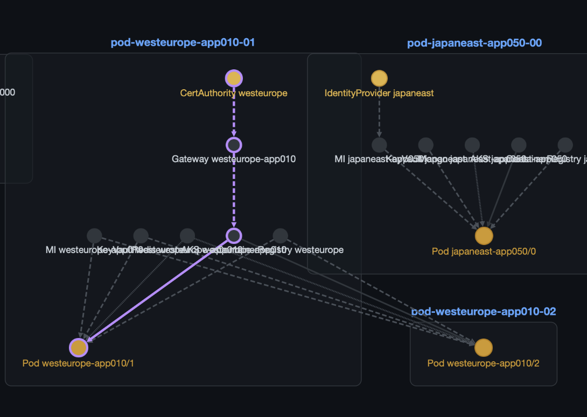
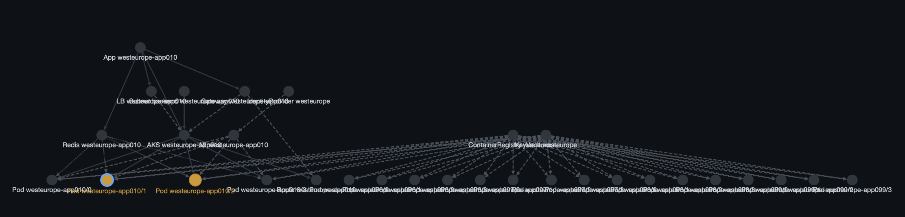
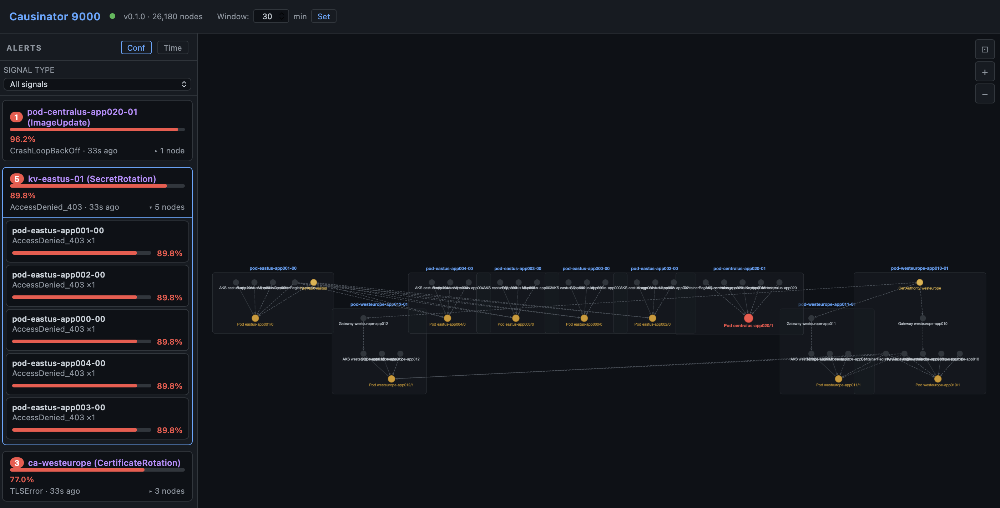

# Causinator 9000

*A reactive causal inference engine for cloud infrastructure.*

**When production breaks, the hard question is never "what's on fire?" It's "which change lit the match?"** A cert rotated, a deploy shipped, a policy landed, a disk went read-only, and thirty dashboards turn red at once. Traditional monitoring correlates symptoms ("500s are up") but can't tell you the cause, so on-call burns the first hour ruling out suspects by hand.

Causinator 9000 answers the causal question directly. Feed it your dependency graph, recent **mutations** (changes to infrastructure), and degradation **signals** (observed symptoms), and it computes the probability that each change caused each symptom, traces the causal path upstream through your dependency graph, and ranks the competing suspects by confidence.

Nothing about the engine is tied to a particular cloud, or even to the cloud at all. It reasons over any dependency graph you can describe, so the same solver works across the domains where changes and failures actually live:

- **Kubernetes**: an `ImageUpdate` traced to `CrashLoopBackOff` at 96% confidence
- **CI/CD**: a red nightly build attributed to the offending commit rather than a flaky-test latent cause
- **Cloud infrastructure** (Azure, AWS, GCP, or on-prem): a secret rotation propagating to the services that consumed it
- **Cross-boundary incidents**: eight `HTTP_500` alerts correctly split into two independent root causes for two different teams

The engine ships with ready-made adapters for Azure, Kubernetes, GitHub Actions, and Terraform, but those are just producers writing rows: any system that can describe nodes, edges, and changes can drive it.

The solver never guesses. No change in the window means confidence 0. No causal match means a weak signal. It is built to say *"I don't know"* rather than manufacture a false positive.

Built in Rust. Sub-200µs inference at p95 on a 225,000-node graph (roughly five full cloud regions: on the order of 750 server racks, 2,500 applications, and the tens of thousands of pods, VMs, and network devices beneath them). Two moving parts: **PostgreSQL** as the event store and an **embedded Drasi** change feed. No sidecars, no message queue, no external services.

**Dig deeper:** [how inference works](docs/inference.md) · [the CI GitHub Action](docs/action.md) · [data sources](docs/data-sources.md) · [writing CPTs](docs/cpts.md)

> **Just want CI failure reports? You don't need any of the infrastructure below.** Causinator also ships as a [GitHub Action on the Marketplace](https://github.com/marketplace/actions/causinator-9000-ci-diagnosis) that runs entirely inside GitHub Actions (no database, no server, no cloud account, no API keys beyond the built-in `GITHUB_TOKEN`). Drop one workflow into your repo and get a nightly, weekly, or per-PR Bayesian root-cause report on your CI failures. Jump to [Using the GitHub Action](#using-the-github-action) for copy-paste workflows and configuration.

## Table of Contents

- [Using the GitHub Action](#using-the-github-action)
- [In the Security Sector](#in-the-security-sector)
- [How It Works](#how-it-works)
- [Architecture](#architecture)
- [Quick Start](#quick-start)
- [Data Sources](#data-sources)
- [Web Dashboard](#web-dashboard)
- [CPTs and Inference](#cpts-and-inference)
- [Alert Rules](#alert-rules)
- [API Reference](#api-reference)
- [Project Structure](#project-structure)
- [Performance](#performance)
- [Documentation](#documentation)
- [License](#license)

---

## How It Works

The Causinator 9000 maintains a **Causal Digital Twin**: a directed acyclic graph (DAG) where nodes are infrastructure resources (containers, gateways, key vaults, AKS clusters, and so on) and edges point from cause to effect (upstream to downstream dependency).

When a degradation **signal** arrives (error spike, heartbeat loss, memory pressure), the solver:

1. Walks the target node's **ancestor chain** upstream through the graph
2. Finds all **mutations** (deployments, config changes, cert rotations) within the temporal window on those ancestors
3. Scores each candidate mutation using **likelihood-ratio (LR) Bayesian inference** against the node's **CPT** (Conditional Probability Table, a lookup table encoding how likely each mutation type is to produce each signal type)
4. Applies **temporal decay**: recent mutations get a higher causal prior; each resource class has its own decay rate
5. Applies **hop attenuation**: upstream mutations are discounted by 8% per dependency hop
6. Returns a ranked list of **competing causes** with confidence scores and causal paths

## Architecture

```
Data Producers              Event Store              Inference Engine
─────────────              ───────────              ────────────────
Radius (deploys)    ──┐
Azure Monitor       ──┼──▶  PostgreSQL  ──CDC──▶  drasi-lib (embedded)
LLM Transpiler      ──┘     (WAL)                      │
                                                        ▼
                                                  Bayesian Solver
                                                  (LR inference)
                                                        │
                                              ┌─────────┼──────────┐
                                              ▼         ▼          ▼
                                          REST API   Web UI    Checkpoint
                                          (Axum)   (Cytoscape)  (bincode)
```

**Key design decisions:**

- **Single process.** The engine embeds [drasi-lib](https://github.com/drasi-project/drasi-core) in-process for zero-hop CDC event delivery. No sidecar, no message queue, no IPC.
- **PostgreSQL as the only integration point.** Data producers write SQL. Drasi watches the WAL. No custom protocols.
- **Subgraph-local inference.** Diagnosis activates ~10 to 20 ancestor nodes, not the full graph. Complexity is O(ancestors × active_mutations), not O(graph).

### Why Drasi

[Drasi](https://drasi.io) is an open-source change-driven data platform (a Linux Foundation project). Instead of polling a database on a timer, Drasi watches a source's native change feed (the PostgreSQL write-ahead log in our case), runs **continuous queries** written in Cypher against the incoming change stream, and pushes only the *deltas* to downstream **reactions**. Causinator embeds it as a library (`drasi-lib`), so there is no separate cluster to operate: the source, the continuous queries, and the reaction all run inside the `c9k-engine` process.

Today the engine wires up a single [PostgreSQL source](https://drasi.io/concepts/sources/) with two continuous queries (a mutation tracker and a signal tracker) whose results feed straight into the Bayesian solver. The important part is that the source is **pluggable**: Drasi presents every backend as the same unified stream of *Source Change Events*, so the solver never has to know where a mutation or signal originated.

That matters because the Drasi project keeps adding sources. As of this writing the available implementations include:

| Source | Typical use for Causinator |
|--------|----------------------------|
| **PostgreSQL** | Current default: mutations and signals via WAL replication |
| **MySQL** / **SQL Server** | Ingest change events straight from an existing relational store of record |
| **Kubernetes** | Watch the cluster API for pod, deployment, and event changes as first-class mutations/signals |
| **Azure Event Hubs** | Stream cloud telemetry and platform events without a polling adapter |
| **Azure Cosmos DB (Gremlin)** | Consume an existing property-graph topology natively, no relational translation |
| **Microsoft Dataverse** | Business/ops records as change events |
| **HTTP** / **gRPC** | Push arbitrary change events from any producer over a simple endpoint |
| **Platform (Redis Streams)** / **Mock** | Fan-in from other Drasi components; deterministic testing |

Because each of these speaks the same Source Change Event contract, adding one is largely a matter of pointing a new source at its backend and writing a continuous query that shapes rows into the `mutations`/`signals` model the solver already understands. A Kubernetes source, for example, could replace the current `make ingest-k8s` polling adapter with a live change feed, and an HTTP or gRPC source lets a producer push events directly rather than writing SQL first. The set of supported backends is still growing upstream, so the engine's reach grows with it without any change to the inference core.

## CPTs: Turning Institutional Knowledge Into Math

Every team has a senior engineer who, three minutes into an incident, says something like *"if the pods started crash-looping right after a deploy, it's the deploy: I've seen it a hundred times."* That instinct is real knowledge, but it lives in one person's head, it doesn't scale to 3am, and it walks out the door when they change jobs.

A **CPT** (Conditional Probability Table) is how Causinator writes that instinct down. Each CPT captures one cause-and-effect belief as two numbers:

1. How often you see the symptom **when** the suspected change happened.
2. How often you see the same symptom **when** it did not.

Take the deploy example. A container that just got a new image (`ImageUpdate`) and then started crash-looping (`CrashLoopBackOff`):

```yaml
- mutation: ImageUpdate        # the change
  signal: CrashLoopBackOff     # the symptom
  table:
    - [0.75, 0.03]   # 75% of bad deploys crash-loop; only 3% crash-loop on their own
```

Those two numbers encode exactly what the senior engineer knows: a fresh deploy is a *very* suspicious thing to see next to a crash loop (25 times more likely to be the cause than a coincidence), so when both appear together the engine reports high confidence. The person no longer has to be awake for their experience to be applied.

The power is that this works for knowledge nobody would think to write in a runbook, across every corner of your stack:

- **Security's knowledge.** *"When a secret gets rotated, anything still holding the old one starts getting 403s."* That is a `SecretRotation → AccessDenied_403` CPT of `[0.85, 0.02]`, and it comes with its own timing: identity changes decay slowly (a 4-hour half-life) because cached tokens keep working until they expire, so the engine still suspects a rotation that happened hours ago.
- **The network team's knowledge.** *"A cert rotation on the authority breaks TLS three hops downstream before anyone touches those services."* The engine traces that path automatically and still attributes the TLS errors back to the certificate change.
- **The CI maintainer's knowledge.** *"Half our nightly failures aren't the code, they're flaky tests."* That becomes a competing latent cause, so a red build is weighed against both the suspect commit and the test's known flakiness instead of always blaming the last change.

Because CPTs are just YAML, this knowledge is **reviewable, versioned, and shareable.** You start from the 30 resource classes that ship built in, then encode your own hard-won lessons in `config/heuristics/private.yaml`: every incident post-mortem can end with a one-line CPT so the same surprise never costs you the first hour twice. New numbers hot-reload without a restart.

→ [How to write and calibrate CPTs](docs/cpts.md)

## The Inference Algorithm

Uses **likelihood-ratio (LR) Bayesian inference**: for each (mutation, signal) pair, computes $LR = P(signal \mid mutation) / P(signal \mid no\\ mutation)$ from the resource's **CPT** (Conditional Probability Table), then updates a causal prior via Bayes' theorem. An `ImageUpdate → CrashLoopBackOff` CPT of [0.75, 0.03] gives LR = 25× → 96.2% posterior confidence.

Key features:
- **Per-class temporal decay**: recent mutations score higher; each resource class has its own half-life (Container: 15 min, DNS: 360 min, DenyPolicy: 30 days)
- **Upstream propagation**: traces mutations through the DAG with 8% hop attenuation
- **Competing causes**: ranks multiple candidate mutations; **latent nodes** (unobserved shared dependencies like GHCR, Azure OIDC, flaky test infrastructure) compete with code changes
- **Explaining away**: correlated failures on shared infrastructure converge to a single root cause

→ [Full inference documentation](docs/inference.md)

## In the Security Sector

Security incidents are change-driven: a policy edit, a rotated-but-not-propagated secret, a poisoned image, an opened port. That is exactly the question the engine answers, "which recent change caused this symptom?", so pointing it at security telemetry (audit logs, IAM events, cloud-config changes, registry pushes) instead of infrastructure telemetry needs no new machinery. Security events are just more mutations and signals flowing over the same dependency graph, scored by the same solver. Three of its properties matter disproportionately here.

**Cutting through alert storms.** A single compromised service account or one weakened role can trip hundreds of downstream detections. A SIEM correlates by *signal* ("spike in `AccessDenied`") and files one giant, ambiguous incident, or hundreds of tiny ones. The engine instead groups by *root cause*: it walks each of those 300 `AccessDenied` events upstream and finds they all trace to one `PolicyChange` on one role, so the SOC gets **one incident with one owner** instead of 300 tickets. This is the same explaining-away and root-cause grouping shown in the [alert-groups demo](#alert-groups), pointed at security signals.

**Blast-radius mapping on compromise.** When a secret leaks or a credential is exposed, the urgent question is "what did it touch?" Model the compromised resource (a KeyVault, a managed identity, a registry image) as the changed node, and every downstream service that consumed it is already an edge away in the dependency graph. The solver traces each affected service back to that node with an explicit causal path, turning "which of our systems are exposed?" into a ranked list with a defensible trail, not a week of manual audit. It is the [KeyVault-to-pods scenario](#dashboard-seeding) the engine already demonstrates, reused as an exposure map.

**Supply-chain and shared-dependency attacks.** The engine already models unobserved shared dependencies (a container registry, an OIDC provider, CI runner infrastructure) as **latent nodes** that compete with code changes as explanations. A poisoned base image, a compromised runner, or a malicious transitive dependency therefore surfaces as a *single* latent root cause explaining alerts across many otherwise-unrelated services, collapsing what would look like dozens of independent investigations into one.

Across all three, the same design choices pay off: the solver's low false-positive stance (it reports confidence 0 rather than guessing) fights alert fatigue, and every conclusion comes with an auditable causal path suitable for an incident write-up or compliance evidence. The engine complements a SIEM or EDR rather than replacing it: it is the causal-reasoning layer that turns the detections you already collect into ranked, explained root causes.

## Using the GitHub Action

The fastest way to try Causinator, and the only mode that needs **zero infrastructure**. Everything runs inside GitHub Actions: no database, no server, no cloud account, no Docker image, and no API keys beyond the `GITHUB_TOKEN` every workflow already has. Under the hood the action downloads a ~15MB precompiled `c9k-engine` binary, ingests your recent CI failures via the GitHub API, classifies each one (test, lint, build, timeout, auth, and so on), runs the same Bayesian inference described above, and writes a root-cause report that groups failures by cause, attributes each to a commit, a broken workflow, or a flaky-test latent cause, and ranks them by confidence.

Installed from the [GitHub Marketplace](https://github.com/marketplace/actions/causinator-9000-ci-diagnosis) as `Causinator 9000 CI Diagnosis`.

### Nightly failure report (job summary)

The simplest setup: a scheduled run that posts the diagnosis to the workflow's Summary tab every morning. Nothing is created or commented on, so it needs no extra permissions.

```yaml
# .github/workflows/c9k-nightly.yml
name: C9K Nightly
on:
  schedule:
    - cron: '0 6 * * *'   # every day at 06:00 UTC
jobs:
  report:
    runs-on: ubuntu-latest
    steps:
      - uses: sylvainsf/causinator9000@v1
        with:
          hours: '24'      # look back over the last day
```

### Weekly digest issue

A rolling issue that gets a new comment each week, giving you a running history of CI health. Requires `issues: write`.

```yaml
# .github/workflows/c9k-weekly.yml
name: C9K Weekly Digest
on:
  schedule:
    - cron: '0 9 * * MON'
permissions:
  issues: write
jobs:
  digest:
    runs-on: ubuntu-latest
    steps:
      - uses: sylvainsf/causinator9000@v1
        with:
          create-issue: 'true'
```

### Comment on failed PRs

Trigger after your CI workflow finishes and post the diagnosis as a PR comment so authors see why their build broke. Requires `pull-requests: write`.

```yaml
# .github/workflows/c9k-pr.yml
name: C9K PR Diagnosis
on:
  workflow_run:
    workflows: ["CI"]        # replace with your CI workflow name
    types: [completed]
permissions:
  pull-requests: write
jobs:
  diagnose:
    if: ${{ github.event.workflow_run.conclusion == 'failure' }}
    runs-on: ubuntu-latest
    steps:
      - uses: sylvainsf/causinator9000@v1
        with:
          hours: '48'
          post-comment: 'true'
```

### Configuration

Common inputs (all optional):

| Input | Default | Description |
|-------|---------|-------------|
| `hours` | `168` | Lookback window in hours (168 = one week; use `24` for nightly) |
| `min-confidence` | `50` | Minimum confidence (0-100) for a finding to appear in the report |
| `create-issue` | `false` | Create or update a rolling digest issue |
| `issue-label` | `c9k-digest` | Label applied to the digest issue |
| `post-comment` | `false` | Post the diagnosis as a PR comment |
| `repo` | current repo | Analyze a different repo (needs a token with `actions:read` on it) |
| `github-token` | `${{ github.token }}` | Token for API access and posting |
| `version` | `latest` | Pin a specific `c9k-engine` release |
| `include-user-prs` | `false` | Include contributor PR-branch failures (noisy; off by default) |

Outputs: `report` (the markdown report) and `alert-count` (number of root-cause groups found), for use in later steps.

**Auto-issue mode** is an opt-in advanced mode that files one deduplicated, assignable issue per detected root cause (with optional Copilot assignment, flaky-test auto-close, and a dry-run preview). It has its own set of `auto-issue-*` inputs. See the full guide for the workflow and every flag.

→ [Full action documentation](docs/action.md)

## Data Sources

The engine ingests topology, mutations, and signals from multiple sources:

| Source | What it provides | Command |
|--------|-----------------|---------|
| Azure Resource Graph | Infrastructure topology (VMs, NICs, AKS, KV, etc.) | `make ingest-arg` |
| Azure Resource Changes | ARM-level mutations (config changes, scale events) | `make ingest-azure-health` |
| Azure Resource Health | Degraded/Unavailable signals | `make ingest-azure-health` |
| Azure Policy | Deny policy latent nodes + violations | `make ingest-azure-policy` |
| GitHub Actions | CI failures as classified signals, commits as mutations | `make ingest-gh` |
| Kubernetes | Pod topology + events (CrashLoopBackOff, OOMKilled, etc.) | `make ingest-k8s` |
| Terraform State | HCL resources + dependency edges | `make ingest-tf` |

Real-time receivers: `make webhook-gh` (GH webhook :8090), `make webhook-azure` (Event Grid :8091), `make watch-k8s` (K8s event stream).

Full pipeline: `make ingest-all`

→ [Data sources reference](docs/data-sources.md)

### GitHub Actions Ingestion

The GitHub Actions source adapter (`sources/gh_actions_source.py`) is the most
sophisticated data source, building a causal graph from CI/CD failure data:

**What it does:**
1. Fetches failed workflow runs via `gh run list --status failure`
2. Downloads failure logs and classifies errors into signal types
   (`TestFailure`, `AzureAuthFailure`, `LintFailure`, `BuildFailure`, etc.)
3. Attributes failures to either code changes (commit nodes) or infrastructure
   (latent nodes like `latent://azure-oidc`, `latent://flaky-tests`)
4. For scheduled/nightly tests, walks commit ancestry back to the last successful
   run, creating multiple competing commit causes with temporal decay
5. Computes per-workflow historical flaky rates to calibrate flaky-test priors

**Causal domains:** Failures are classified into independent causal domains
based on the GitHub event type and branch:

| Domain | Events | Behavior |
|--------|--------|----------|
| `pr` | `pull_request`, `push`, `dynamic` | Commit mutation timestamped at run start |
| `schedule` | `schedule` on default branch | Commit mutation timestamped at commit author date; ancestor commits added as competing causes |
| `dispatch` | `workflow_dispatch` on default branch | Same as `schedule` |
| `release` | `schedule`/`dispatch` on non-default branch | Routed to `latent://release-validation/{branch}` instead of blaming a commit |

**Options:**
- `--exclude-workflow "Name"`: skip specific workflows (repeatable)
- `--hours N`: lookback window
- `--fast`: classify from step names only (skip log downloads)

**Known limitations and future work:**

The current source adapter is a monolithic Python script that handles fetching,
classification, graph construction, and engine communication. This should be
refactored into a modular pipeline:

1. **Fetcher module**: downloads runs and logs from the GitHub API. Should be
   swappable for other CI systems (GitLab CI, Jenkins, CircleCI, Azure DevOps).
2. **Classifier module**: maps error logs to signal types. Currently uses
   regex patterns; should support pluggable classifiers (LLM-based, ML-based,
   or project-specific rule files).
3. **Graph builder module**: constructs nodes, edges, mutations, and signals.
   The causal domain logic, commit ancestry, and flaky rate computation belong
   here.
4. **Engine client module**: sends the constructed graph to the C9K engine.
   Currently uses urllib; should be a shared client used by all source adapters.

This modular approach would allow:
- Adding new CI providers without rewriting the graph logic
- Project-specific classifiers (e.g., a Radius classifier that knows about
  `rad deploy` failures, or a Kubernetes classifier for Helm chart issues)
- Testing each stage independently
- Sharing the graph builder across disparate data sources

## CPTs and Inference

**Conditional Probability Tables (CPTs)** encode causal relationships between mutations and signals. Each CPT entry says: "if this mutation happened, how likely is this signal? And how likely is the signal without the mutation?" The ratio of these two values is the **likelihood ratio (LR)**, the core number driving inference.

CPTs are organized as modular YAML layers in `config/heuristics/`:

```yaml
- class: Container
  default_prior:
    P_failure: 0.002
    decay_half_life_minutes: 15
  cpts:
    - mutation: ImageUpdate
      signal: CrashLoopBackOff
      table:
        - [0.75, 0.03]    # LR = 25× → 96.2% confidence
        - [0.25, 0.97]
```

**30 resource classes** across 12 YAML files, covering Azure infrastructure, CI/CD pipelines, Kubernetes, and project-specific overrides. Add your own via `config/heuristics/private.yaml`.

→ [CPT reference](docs/cpts.md) · [Inference algorithm](docs/inference.md)

## Alert Rules

Permanent alert suppression via `config/alert-rules.yaml`:

```yaml
rules:
  - signal_type: ChecklistMissing
    action: suppress
    reason: "Shown in PR UI, not an infrastructure concern"
  - max_confidence: 0.05
    action: low
    reason: "Below 5%: background noise"
```

Match on signal type, resource class, node ID pattern (regex), confidence range. UI dismiss button for runtime suppression.

→ [Alert rules reference](docs/alert-rules.md)

## Quick Start

### Install the binary

```bash
# From crates.io / GitHub (no clone needed)
cargo install --git https://github.com/sylvainsf/causinator9000 c9k-engine

# Or build from source
git clone https://github.com/sylvainsf/causinator9000.git
cd causinator9000
make install                       # installs to /usr/local/bin
```

The binary includes all standard heuristics compiled in, no config files
needed. Just run `c9k-engine` from any directory.

### Run the engine

```bash
c9k-engine                         # starts on :8080 with embedded heuristics
curl http://localhost:8080/api/health
```

### Heuristics

The engine ships with 30 resource classes of built-in heuristics. By default
it looks for `config/heuristics.manifest.yaml` in the current directory and
falls back to the embedded set if not found.

| Option | Description |
|---|---|
| `--embedded-heuristics` | Always use built-in heuristics, ignore disk |
| `--heuristics <path>` | Load heuristics from a specific file |
| `C9K_HEURISTICS=<path>` | Same as `--heuristics`, via environment variable |

To extend with your own project-specific heuristics, create a YAML file
(see `config/heuristics/private.yaml.example`) and point to it:

```bash
c9k-engine --heuristics my-heuristics.yaml
```

### Development setup

If you're working on C9K itself or want the full data ingestion pipeline:

### Prerequisites

- **Rust** (1.85+ stable): `curl --proto '=https' --tlsv1.2 -sSf https://sh.rustup.rs | sh`
- **Python 3.9+**: for source adapters
- **az CLI** + `az login`: for Azure topology ingestion
- **gh CLI** + `gh auth login`: for GitHub Actions ingestion
- **kubectl**: for Kubernetes pod topology (optional)

### Setup

```bash
# Clone and configure
git clone https://github.com/sylvainsf/causinator9000.git
cd causinator9000
make env-init                      # create .env from template, edit with your values
make build-release                 # build optimized binary

# Start the engine
make run-release                   # starts in background on :8080
make health                        # verify: ✓ Engine OK

# Ingest real infrastructure data
make ingest-all                    # ARG topology + Azure changes + policies + GH Actions

# Open the dashboard
make open                          # opens http://localhost:8080
```

### Makefile Reference

Run `make help` to see all targets:

```
  Build & Run
  build / build-release            Build debug/release binaries
  test                             Run all tests
  run / run-release                Start engine (foreground/background)
  restart                          Rebuild and restart
  stop                             Stop the engine

  Data Ingestion (polling)
  ingest-all                       Full pipeline: ARG + health + policy + GH
  ingest-arg                       Azure topology from ARG (replaces graph)
  ingest-arg-merge                 Azure topology (additive merge)
  ingest-azure-health              Resource Health signals + Resource Changes mutations
  ingest-azure-policy              Deny policy latent nodes
  ingest-gh                        GitHub Actions failures
  ingest-k8s                       Kubernetes cluster state
  ingest-tf STATE=...              Terraform state

  Real-time Receivers
  webhook-gh                       GitHub webhook receiver (:8090)
  webhook-azure                    Azure Event Grid receiver (:8091)
  watch-k8s                        Kubernetes event stream

  Diagnostics
  status                           Engine status (nodes, edges, mutations, signals)
  alerts                           Current alert groups
  islands                          Causal islands summary
  health                           Quick health check

  Configuration
  config                           Show current configuration
  env-init                         Create .env from template
  reload-cpts                      Hot-reload CPT heuristics
  clear                            Clear all mutations and signals
  open                             Open web dashboard
```

All targets read from `.env` (gitignored) for subscription IDs, repo names, ports, etc.

### Stress Tests

```bash
cargo run --release --bin c9k-load-test                          # 44k qps
cargo run --release --bin c9k-scale-test                         # 225k nodes, p95=210µs
```

---

## Web Dashboard

The engine serves a zero-build web dashboard at **http://localhost:8080/** when running. Built with [Cytoscape.js](https://js.cytoscape.org/): a single HTML file, no npm, no build step.

### Alert Tree View

The default view shows only the nodes involved in active alerts, laid out as discrete causal trees using the `dagre` hierarchical layout. Each cluster represents one alert and its causal context: the affected node, its upstream ancestors, and the root cause path.



*Alert trees for 4 active incidents: a KeyVault secret rotation affecting 3 pods (1-hop), a CertAuthority rotation propagating through Gateway → AKS → Pod (3-hop), an IdentityProvider policy change (2-hop), and a direct ImageUpdate crash.*

**Node colors:**
- 🔴 **Red** (Alert): node has both an active signal and a matching mutation
- 🟠 **Orange** (Signal): node has a degradation signal but no mutation on it directly
- 🟡 **Yellow** (Mutation): node has a recent mutation but no signal (potential cause)
- ⚪ **Gray** (Normal): no active evidence

### Alert Cards

The left panel lists all active alerts as cards, sorted by confidence (default) or time. Each card shows the node ID, signal type, confidence bar, root cause attribution, and time since the alert fired.



*Alerts sorted by confidence: 96.2% ImageUpdate crash, 89.8% KeyVault rotation, 82.6% IdentityProvider change, 77.0% CertAuthority rotation.*

**Filtering:** Use the dropdowns above the alert list to filter by node class (Container, Gateway, KeyVault, etc.) or signal type (CrashLoopBackOff, TLSError, AccessDenied_403, etc.). Filters apply to both the card list and the graph view.

**Sorting:** Toggle between `Conf` (confidence descending) and `Time` (most recent first).

### Node Detail Panel

Clicking a node or alert card opens the detail panel on the right, showing:

- **Confidence score** with percentage
- **Root cause**: the mutation identified as the most likely cause
- **Causal path**: clickable chain from root cause to affected node (e.g., `ca-westeurope → appgw-westeurope-app010 → aks-westeurope-app010 → pod-westeurope-app010-01`)
- **Competing causes**: ranked alternatives with individual confidence bars
- **Show Neighborhood** button: switches to a detailed local subgraph view



*Detail panel showing a 3-hop causal path from CertAuthority through Gateway and AKS to the affected pod, with 77.0% confidence.*

### Neighborhood View

Click "Neighborhood" in the top bar or the "Show Neighborhood" button in the detail panel to see a 2-hop subgraph around the selected node, automatically laid out with the `dagre` algorithm. This view shows the full dependency context: upstream causes and downstream effects.



*Neighborhood view of pod-eastus-app001-00 showing its upstream dependencies: AKS cluster, KeyVault, ContainerRegistry, ManagedIdentity, and the application/subnet containment hierarchy.*

### Alert Groups

When multiple alerts share a common root cause, the dashboard collapses them into **incident groups** (one per root cause) with a count badge and expandable member list.

The critical insight: **grouping is by root cause, not by signal type.** Consider two services on the same AKS cluster, both returning `HTTP_500` within a 5-minute window. Traditional monitoring sees "elevated 500s" and creates one big incident. The engine looks upstream and identifies two completely independent root causes:

- **Group A** (4 pods): `ds-centralus-app015`, the managed disk backing app015's SQL database went read-only (`BlockDeviceReadOnly`). All pods querying that store start 500ing. → Storage team.
- **Group B** (4 pods): `aks-centralus-app016`, a deployment pushed a new container image with a bug (`Deployment`). All pods restart with the bad code and 500. → Dev team rollback.

Same symptom. Different causes. Different response teams. Naive signal-type grouping merges them into one incident, hiding the fact that two independent failures need two independent responses.



*8 HTTP_500 alerts from 2 simultaneous incidents, correctly separated into 2 groups. Both groups show the same signal type, but the engine distinguishes them by tracing each pod's 500 upstream through the causal graph to find the actual root cause.*

To seed the alert groups demo:

```bash
python3 scripts/screenshot_data.py
```

### Temporal Window Control

The temporal window (default: 24 hours) controls how far back the solver looks for candidate mutations. Adjust it in real time using the input in the top bar: type a value in minutes and click "Set." The change takes effect immediately for all subsequent diagnoses.

### Dashboard Seeding

To populate the dashboard with sample alerts:

```bash
python3 scripts/seed_alerts.py
```

This injects 4 cross-boundary alert scenarios (KeyVault → pods, CertAuthority → Gateway → AKS → pods, IdentityProvider → ManagedIdentity → pods, and a direct deploy crash). Open http://localhost:8080/ to see the causal trees.

---

## API Reference

All endpoints are available under both `/api/` and root paths.

| Endpoint | Method | Description |
|---|---|---|
| `/api/health` | GET | Node/edge counts, active mutation/signal counts |
| `/api/diagnosis?target=<id>` | GET | Diagnose a node: confidence, root cause, causal path, competing causes |
| `/api/diagnosis/all` | GET | All active diagnoses above threshold |
| `/api/alerts` | GET | Active alerts with diagnosis, sorted by confidence |
| `/api/alert-graph` | GET | Cytoscape JSON of alert-affected subgraphs only |
| `/api/neighborhood?node=<id>&depth=2` | GET | Cytoscape JSON of node's local subgraph |
| `/api/graph/{island}` | GET | Full graph as Cytoscape JSON |
| `/api/graph/load` | POST | Load a complete graph from JSON (`{"nodes": [...], "edges": [...]}`) |
| `/api/graph/export` | GET | Export the current graph as structured JSON |
| `/api/mutations` | POST | Inject a mutation: `{"node_id": "...", "mutation_type": "..."}` |
| `/api/signals` | POST | Inject a signal: `{"node_id": "...", "signal_type": "...", "severity": "..."}` |
| `/api/clear` | POST | Clear all active mutations and signals |
| `/api/reload-cpts` | POST | Hot-reload CPTs from disk without restart |
| `/api/window` | GET/POST | Get or set temporal window in minutes (`{"minutes": 1440}`) |
| `/api/memory` | GET | Solver memory info: node/edge/index counts |

### Example: Inject and Diagnose

```bash
# Inject a mutation
curl -X POST http://localhost:8080/api/mutations \
  -H 'Content-Type: application/json' \
  -d '{"node_id": "pod-eastus-app042-01", "mutation_type": "ImageUpdate"}'

# Inject a signal
curl -X POST http://localhost:8080/api/signals \
  -H 'Content-Type: application/json' \
  -d '{"node_id": "pod-eastus-app042-01", "signal_type": "CrashLoopBackOff", "severity": "critical"}'

# Diagnose
curl 'http://localhost:8080/api/diagnosis?target=pod-eastus-app042-01' | python3 -m json.tool
```

Response:
```json
{
    "target_node": "pod-eastus-app042-01",
    "confidence": 0.962,
    "root_cause": "pod-eastus-app042-01 (ImageUpdate)",
    "causal_path": ["pod-eastus-app042-01"],
    "competing_causes": [
        ["pod-eastus-app042-01 (ImageUpdate)", 0.962]
    ],
    "timestamp": "2026-03-06T..."
}
```

---

## Project Structure

```
causinator9000/
├── Cargo.toml                          # Workspace: c9k-engine, c9k-cli
├── config/
│   ├── heuristics.manifest.yaml        # Manifest listing heuristic layers to load
│   ├── heuristics.yaml                 # Flat CPT file (legacy / backward compat)
│   └── heuristics/
│       ├── containers.yaml            # Container, ContainerRegistry, AKSCluster
│       ├── compute.yaml               # VirtualMachine
│       ├── networking.yaml            # VirtualNetwork, SubnetGateway, NIC, DNS
│       ├── routing.yaml               # LoadBalancer, Gateway, HttpRoute
│       ├── databases.yaml             # SqlDatabase, MongoDatabase, RedisCache
│       ├── identity.yaml              # ManagedIdentity, KeyVault, IdP, CertAuthority
│       ├── messaging.yaml             # MessageQueue
│       ├── physical-infra.yaml        # ToRSwitch, AvailabilityZone, PowerDomain
│       ├── applications.yaml          # Application, Environment
│       └── private.yaml.example       # Example private override layer
├── prompts/
│   └── transpiler.md                   # LLM prompt for ARM JSON → graph SQL
├── scripts/
│   ├── schema.sql                      # PostgreSQL schema
│   ├── transpile.py                    # Graph transpiler (LLM or synthetic)
│   ├── demo.py                         # Interactive 10-scenario demo
│   ├── load_test.py                    # 4-test stress suite
│   ├── golden_tests.py                 # Correctness validation
│   ├── seed_alerts.py                  # Seed dashboard with sample alerts
│   ├── screenshot_data.py              # Seed alert-groups screenshot demo
│   ├── smoke_test.py                   # Quick pipeline test
│   ├── load_generator.py               # Signal flood generator
│   ├── radius_receiver.py              # Radius webhook → PG
│   └── monitor_receiver.py             # Azure Monitor webhook → PG
├── crates/
│   ├── c9k-engine/                    # Main service
│   │   └── src/
│   │       ├── main.rs                 # Startup, Drasi init, API launch
│   │       ├── solver/mod.rs           # LR inference, temporal decay, diagnosis
│   │       ├── solver/ve.rs            # Variable elimination (available, not primary)
│   │       ├── api/mod.rs              # REST + static file serving
│   │       ├── drasi/mod.rs            # drasi-lib integration
│   │       ├── lib.rs                  # Library re-exports for test crates
│   │       └── checkpoint/mod.rs       # Bincode state persistence
│   ├── c9k-cli/                       # CLI binary (CPT management, diagnosis, graph ops)
│   │   └── src/main.rs
│   └── c9k-tests/                     # Rust test suite + load test binaries
│       └── src/
│           ├── lib.rs                  # Test client, latency stats
│           ├── topology.rs             # Programmatic topology builder (any scale)
│           └── bin/
│               ├── load_test.rs        # 4-test stress suite (Rust, 44k qps)
│               └── scale_test.rs       # Memory + latency scaling test
├── web/
│   └── index.html                      # Cytoscape.js dashboard (zero-build)
└── docs/
    └── screenshots/                    # Dashboard screenshots for README
```

## Performance

### Inference Latency

Inference is O(ancestors × active_mutations), not O(graph). Graph size affects memory and load time, but has **zero impact** on diagnosis speed.

| Graph Scale | Nodes | Edges | p50 | p95 | RSS |
|---|---|---|---|---|---|
| Tiny (1 rack) | 203 | 425 | 0.15 ms | 0.23 ms | 35 MB |
| Standard (10 regions) | 26,270 | 49,490 | 0.14 ms | 0.21 ms | 84 MB |
| Azure Region (150 racks, 500 apps) | 45,167 | 61,155 | 0.13 ms | 0.23 ms | 190 MB |
| **5 Azure Regions** | **225,835** | **305,775** | **0.15 ms** | **0.21 ms** | **611 MB** |

Diagnosis latency stays at ~0.2 ms (200 microseconds) from 200 nodes to 225,000 nodes.

### Stress Tests (Rust)

```bash
# All 4 stress tests
cargo run --release --bin c9k-load-test

# Scale test: progressive topology scaling with memory measurement
cargo run --release --bin c9k-scale-test

# Multi-region scale test (1-5 Azure production regions, up to 225k nodes)
cargo run --release --bin c9k-scale-test -- --preset multi-region
```

| Test | Result |
|---|---|
| Fan-out (1 mutation → 200 pods) | p95 = 0.2 ms, all 200 traced to shared KeyVault |
| Concurrent (64 threads × 1000 queries) | p95 = 1.7 ms, **44,168 qps** |
| Large window (20k active events) | p95 = 0.4 ms |
| Sustained flood (30s inject + diagnose) | p95 = 1.5 ms, 3,203 diag/s |
| Memory scaling | ~2.7 KB/node, 225k nodes fits in 611 MB |

### Topology Builder

Generate realistic Azure infrastructure topologies at any scale: pure Rust, no SQL, no files:

```rust
use c9k_tests::topology::TopologyBuilder;

// Standard POC (~26k nodes)
let graph = TopologyBuilder::standard().build();

// Single Azure production region (~45k nodes)
let graph = TopologyBuilder::azure_region().build();

// 5 Azure regions (~225k nodes)
let graph = TopologyBuilder::azure_multi_region(5).build();

// Custom
let graph = TopologyBuilder::new()
    .regions(3)
    .racks_per_region(50)
    .vms_per_rack(20)
    .apps_per_region(200)
    .pods_per_app(6)
    .build();

// Load directly via API
client.post("/api/graph/load").json(&graph).send().await?;
```

## Documentation

| Document | Description |
|----------|-------------|
| [Inference Algorithm](docs/inference.md) | Likelihood-ratio math, temporal decay, upstream propagation, competing causes |
| [CPT Reference](docs/cpts.md) | CPT format, writing guidelines, P_failure calibration, layer system, all 30 classes |
| [Data Sources](docs/data-sources.md) | All source adapters, mutation/signal types, node ID conventions |
| [Alert Rules](docs/alert-rules.md) | Suppression config, match fields, runtime dismiss API |

## License

MIT License

Copyright (c) 2026 Sylvain Niles

Permission is hereby granted, free of charge, to any person obtaining a copy of this software and associated documentation files (the "Software"), to deal in the Software without restriction, including without limitation the rights to use, copy, modify, merge, publish, distribute, sublicense, and/or sell copies of the Software, and to permit persons to whom the Software is furnished to do so, subject to the following conditions:

The above copyright notice and this permission notice shall be included in all copies or substantial portions of the Software.

THE SOFTWARE IS PROVIDED "AS IS", WITHOUT WARRANTY OF ANY KIND, EXPRESS OR IMPLIED, INCLUDING BUT NOT LIMITED TO THE WARRANTIES OF MERCHANTABILITY, FITNESS FOR A PARTICULAR PURPOSE AND NONINFRINGEMENT. IN NO EVENT SHALL THE AUTHORS OR COPYRIGHT HOLDERS BE LIABLE FOR ANY CLAIM, DAMAGES OR OTHER LIABILITY, WHETHER IN AN ACTION OF CONTRACT, TORT OR OTHERWISE, ARISING FROM, OUT OF OR IN CONNECTION WITH THE SOFTWARE OR THE USE OR OTHER DEALINGS IN THE SOFTWARE.
